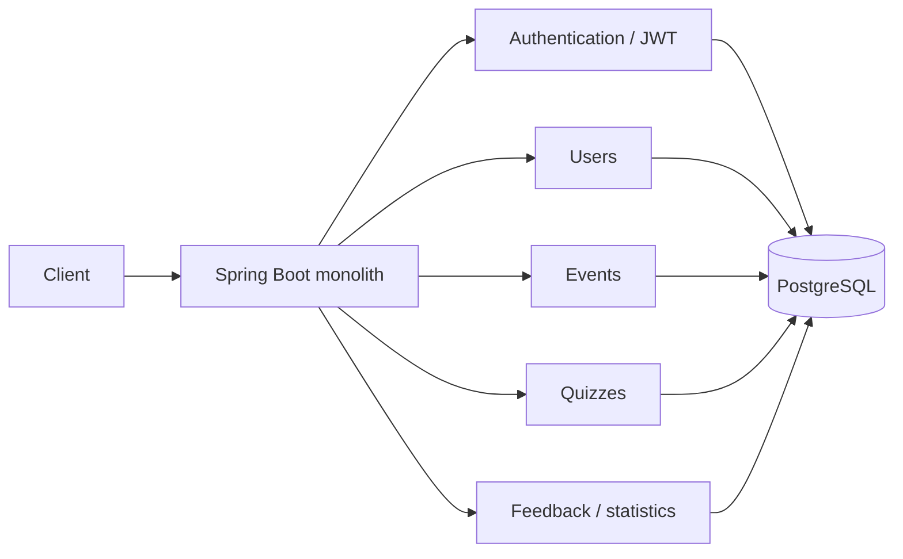
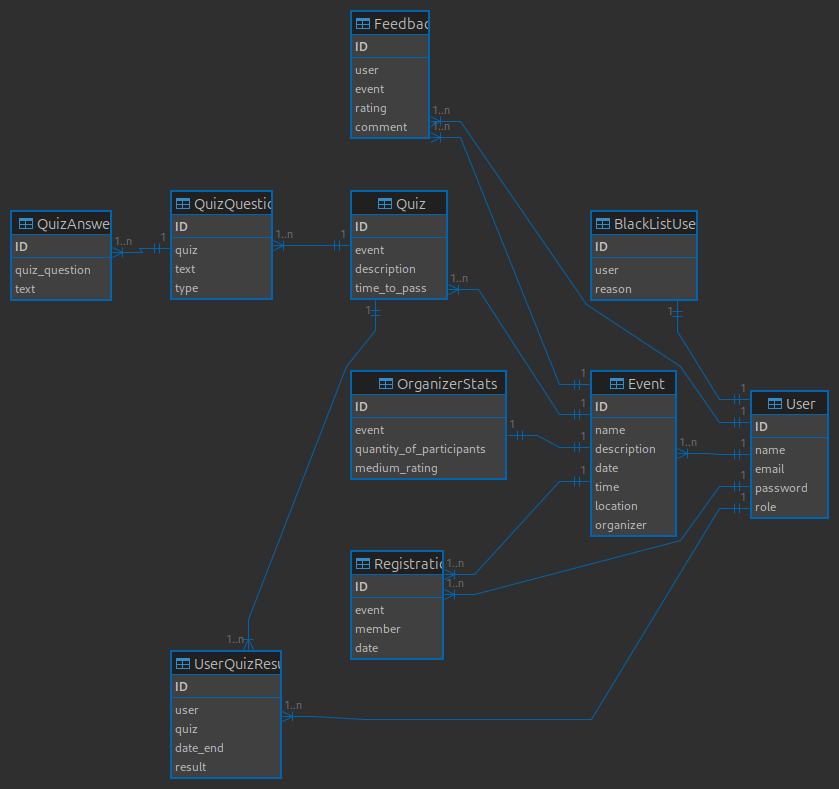
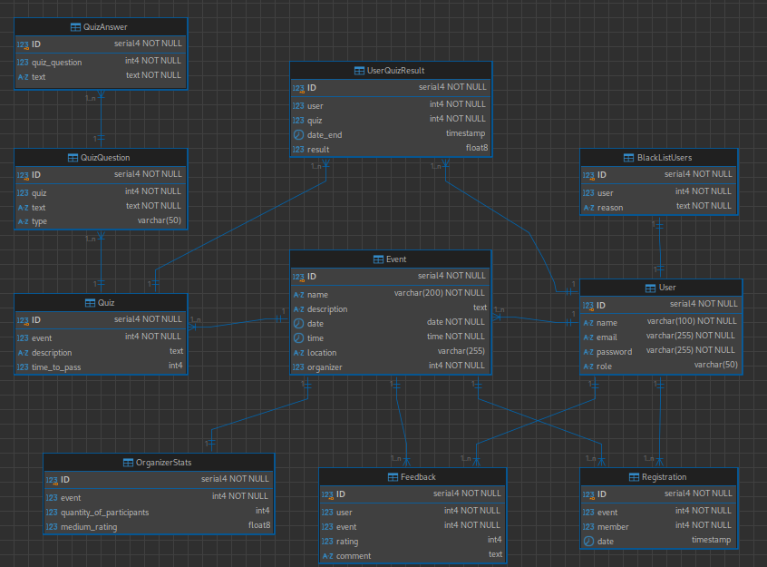

# Event Portal — монолитная версия

Монолитная версия платформы **Event Portal** для создания и проведения мероприятий. Проект разрабатывался как курсовая работа по информационным системам и стал архитектурной основой для последующего перехода к микросервисам.

> Актуальное развитие проекта: [**Event Portal Microservices**](https://github.com/andrey8080/event-portal-microservices) — версия с отдельными backend-сервисами, API Gateway, Angular frontend, Docker Compose и CI.

## О проекте

Event Portal объединяет основные сценарии работы с мероприятиями в одном backend-приложении:

- регистрация и авторизация пользователей;
- JWT-аутентификация;
- роли пользователей;
- создание и управление мероприятиями;
- регистрация участников на события;
- квизы и хранение результатов;
- отзывы и оценки;
- статистика организаторов;
- работа с PostgreSQL;
- бизнес-логика и доступ к данным через Spring JDBC.

Проект интересен прежде всего как исходная точка архитектурной эволюции **монолит → микросервисы**.

## Архитектура



В монолитной версии вся серверная бизнес-логика находится в одном Spring Boot приложении и работает с общей PostgreSQL-базой.

В микросервисной версии эти зоны ответственности были разделены между `auth-service`, `user-service`, `event-service`, `quiz-service`, `geo-service` и `gateway-service`.

## Стек

### Backend

- Java 17
- Spring Boot 3.4.3
- Spring Web
- Spring Security
- Spring JDBC
- JWT (`jjwt`)
- PostgreSQL
- Gradle

### База данных

Проектная модель включает:

- `User`
- `Event`
- `Registration`
- `Quiz`
- `QuizQuestion`
- `QuizAnswer`
- `UserQuizResult`
- `Feedback`
- `OrganizerStats`
- `BlackListUsers`

Также используются PL/pgSQL-функции и триггеры для отдельных бизнес-сценариев и автоматического пересчёта статистики.

## Модель данных

### ER-диаграмма



### Даталогическая модель



Подробное описание схемы, SQL-скрипты, триггеры, функции и исследование индекса находятся в [stage2.md](stage2.md).

## Структура репозитория

Из-за требований учебного проекта код и документация исторически разделены по веткам.

| Ветка | Содержимое |
|---|---|
| `main` | документация, SRS, модель БД и SQL-материалы |
| `back` | монолитный backend на Spring Boot |
| `front` | отдельная ветка frontend-части проекта |

Backend содержит контроллеры пользователей и мероприятий, сервисный слой, JWT-фильтр, конфигурацию Spring Security и инициализацию базы данных.

## Запуск backend

```bash
git clone https://github.com/andrey8080/event-portal-monolit.git
cd event-portal-monolit
git checkout back
./gradlew bootRun
```

Для работы приложения требуется PostgreSQL с параметрами подключения, указанными в конфигурации backend.

Сборка:

```bash
./gradlew clean build
```

Тесты:

```bash
./gradlew test
```

## Документация

- [SRS — требования к системе](srs_document.pdf)
- [Проектирование БД и SQL](stage2.md)
- [Тестирование индекса](test_index.sql)

## Эволюция проекта

```text
SRS и проектирование БД
          ↓
Монолитный Spring Boot backend
          ↓
Декомпозиция предметной области
          ↓
Event Portal Microservices
```

Продолжение проекта: **[event-portal-microservices](https://github.com/andrey8080/event-portal-microservices)**.
